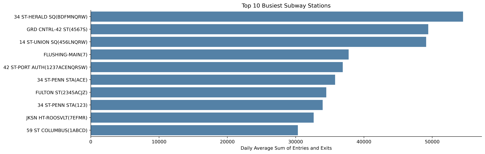
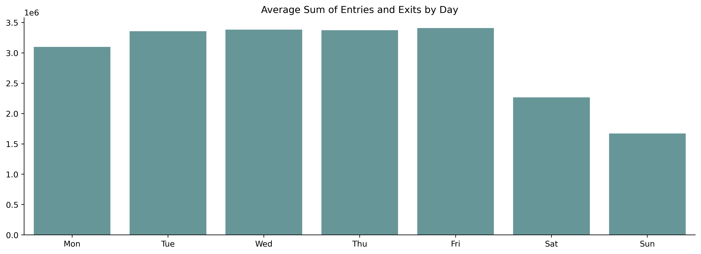
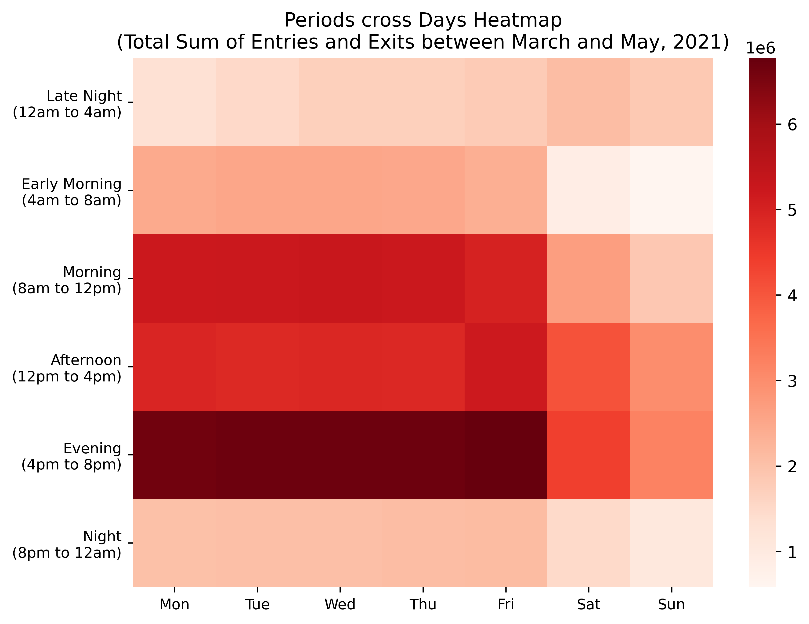
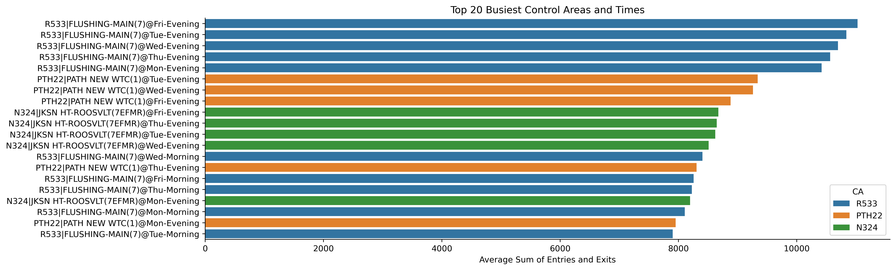
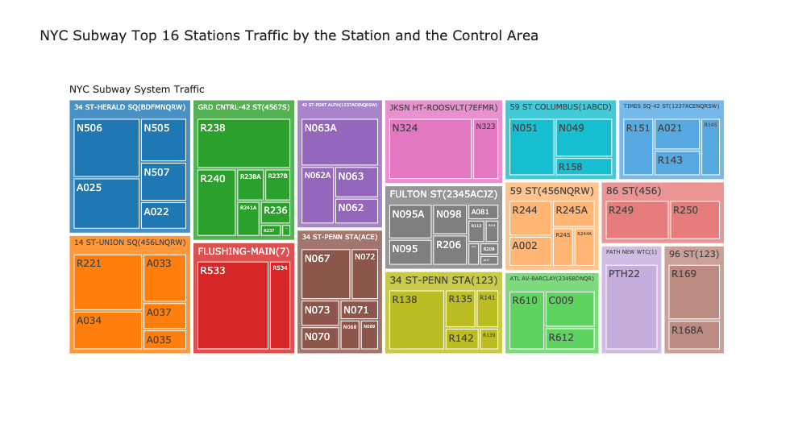
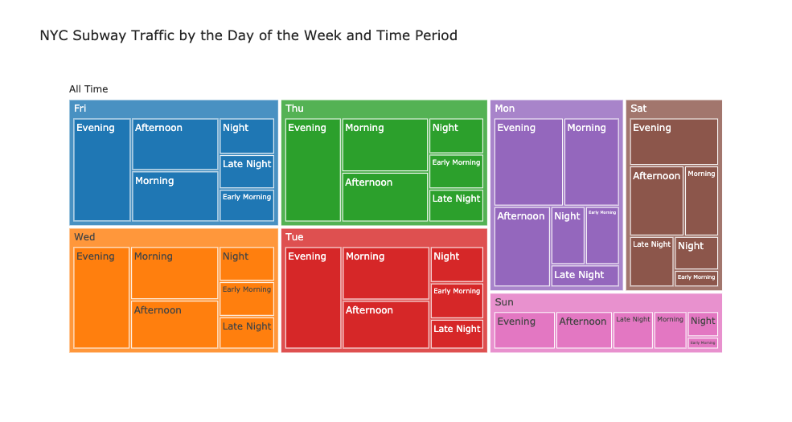

###### More detail about this project: [MTA EDA Project Github Repo](https://github.com/koscew/Metis_Module1_EDA_Project)

#### The Skills 
Today, I finished my first project with Metis. This first module was about Exploratory Data Analysis (EDA). The main skills I learned were SQL, Python Pandas, Python Numpy, Python SQLAlchemy, Python Matplotlib, Python Seaborn. I also explored Python Plotly and plan to check Python Geopandas, Folium and Bokeh later by myself. 

#### The First Two Weeks
I also learned some things beside the skills in my first two weeks.  

* Try to digest what I learned from the course today and apply to the project.
* Learn from doing, from each other, from helping others
* Try to use function to do let the machine do those duplicate things for you
* Believe yourself first

#### The Project
This project was design to make a suggestion for the client to place street teams at entrances to promote their event at the beginning of the summer by [MTA turnstile data](http://web.mta.info/developers/turnstile.html). I designed to identify the busiest entrances and hours among MTA stations in New York with the highest entires and exits between March and May in 2021. At the end of this project, I identified the busiest control areas and the periods of the day and made a function to help with scheduling by inputting the outreach duration, the amount of teams, and the weekly outreach capacity per team.

#### The Data and Algorithm
The dataset between 3/1/2021 and 5/31/2021 contains 2,747,757 rows with 11 features. The most time-consuming part was cleaning the data. The data is a little messy such as incorrect audit numbers and same station names with different linenames at different locations. The most algorithmic work was keep grouping the turnstiles and the times and aggregated the sum and finally the mean to the level of control areas and the periods of the day.

#### Highlights

* 34 St - Herald Sq Subway Station was the busiest station

* Friday was the busiest day

* Evening was the busiest period

* R533 at Flusshing-Main Station was the busiest control areas

* Treemaps by Plotly

